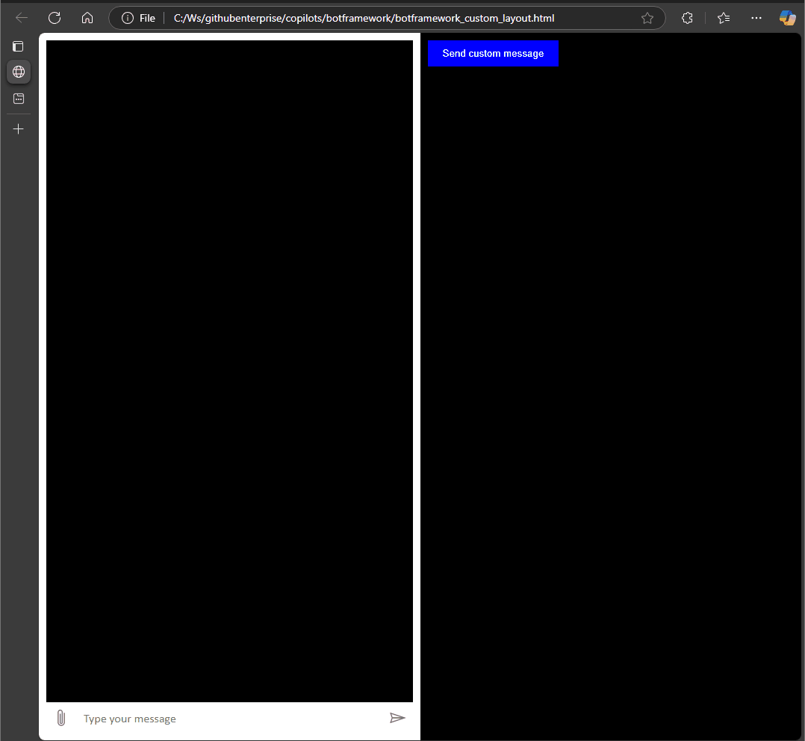

# Microsoft Copilot Studio with Bot Framework SDK

## Description

This folder contains samples how to use Bot Framework SDK Javascript library to fully customize a Microsoft Copilot Studio Agent. The only thing we need is to create a Copilot Studio agent and use its Directline endpoint to interact with it. 

The Bot Framework SDK is available in mulitple languages: C#, JS and  Python.

The folder primarily contains the following files:
 - [botframework_custom_layout.html](botframework_custom_layout.html): This file contains the HTML and JavaScript code to integrate the Bot Framework Web Chat with custom styling and functionality.
 - [config.js](config.js): This file contains the configuration options for the Bot Framework Web Chat, including the Direct Line token URL and domain.
 - [botframework.html](botframework.html): This file contains the bare minimum HTML and JavaScript code to integrate the Copilot Studio agent into a web frontend.


 

## Details
We utilize webchat.js to host our Copilot Studio agent into our HTML page. We send custom messages to the chatbot and we also demonstrate how to subscribe on  different chatbot activity events to get notified about the answers of the agent. Those answers then are written into a separate HTML paragraph. 

## Usage
Fork this repository and create a config.dev.js file to introduce your own chatbot parameters:
```
const config = {
  directLineTokenUrl: 'https://XXXXXXXXXXXXX.YY.environment.api.powerplatform.com/powervirtualagents/botsbyschema/cr3d7_copilotDirectLineEu/directline/token?api-version=2022-03-01-preview',
  directLineDomain: 'https://europe.directline.botframework.com/v3/directline', // for Europe 
  secret: 'YOUR SECRET'
  };

```

For US-based Copilot Studio agents please replace the directLineDomain value with the following:
```
directLineDomain: 'https://directline.botframework.com/v3/directline' // for US
```

More endpoints and detailed API specification are available here: https://learn.microsoft.com/en-us/azure/bot-service/rest-api/bot-framework-rest-direct-line-3-0-api-reference?view=azure-bot-service-4.0

<B> To obtain the DirectLine endpoint: </B>
- Open up the Settings page of your Copilot Studio Agent
- Go to Security and change the Authentication to No Authentication or authenticate manually
- Open up the Channels tab and pick Direct Line Speech
- Copy the URL and put into the [config.dev.js](config.dev.js) file

<B> To get the DirectLine security secret: </B>
- Go to your Microsoft Copilot Studio agent and open up Settings
- Go to Security blade
- Open up Web Channel Security to get the secret and place it into your [config.dev.js](config.dev.js) file

In the HTML file you will find the following lines:
 ```(JavaScript)
 //Using secret from Copilot Studio (it is not recommended to use secret in production)
        //directLine: window.WebChat.createDirectLine({ secret: config.secret, domain: config.directLineDomain }),
```

> **Note:** The secrets need to be stored on server side. Usually, our implemented authentication method and solution grant access to users and provides an endpoint that we can use to get token generated on server side by using the DirectLine secret: https://docs.microsoft.com/en-us/azure/bot-service/rest-api/bot-framework-rest-direct-line-3-0-authentication?view=azure-bot-service-4.0

## Contributing

Contributions are welcome. Please feel free to fork this repository, make your changes, and then submit a pull request.

## License

The project is licensed under [INSERT LICENSE HERE]. Please see the `LICENSE` file for more information.