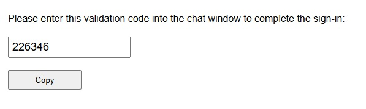
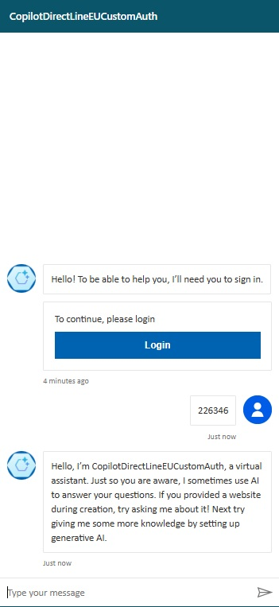
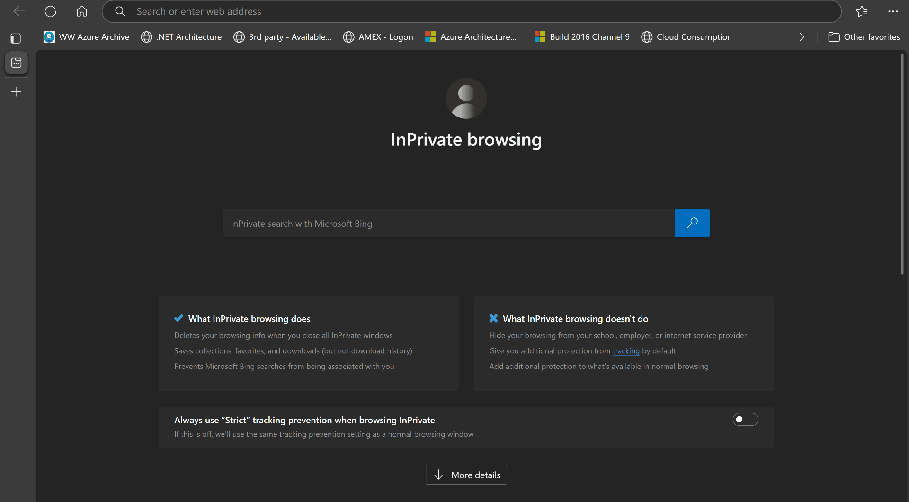
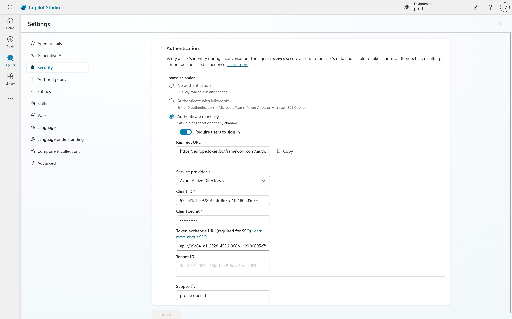
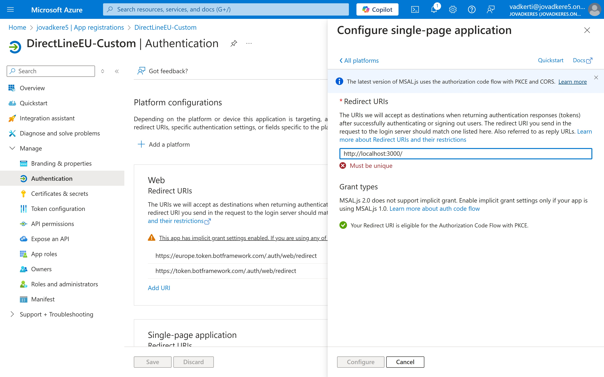
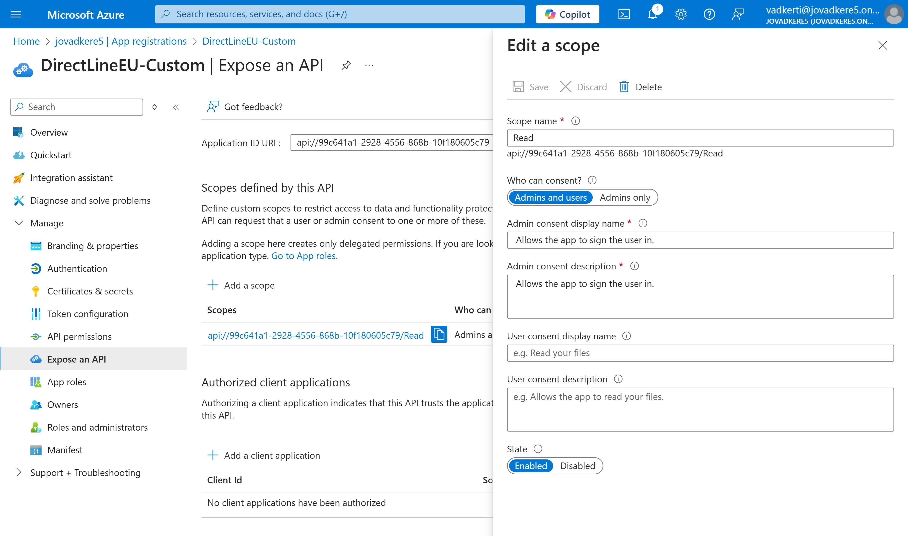

# Single Sign-On for Microsoft Copilot Studio

* [Overview](#overview)
* [Usage](#usage)
* [Contents](#contents)
* [Prerequisites](#prerequisites)
* [Clone or download the sample application](#clone-or-download-the-sample-application)
* [Register the SPA in your tenant](#register-the-spa-in-your-tenant)
* [Configure the project](#configure-the-project)
* [Run the application and sign in](#run-the-application-and-sign-in)
* [Learn More](#learn-more)

## Overview
This sample demonstrates how to single sign-on users (SSO) into Microsoft Copilot Studio Agents in a Vanilla JavaScript single-page application (SPA) by using Microsoft Entra ID. The sample utilizes the [Microsoft Authentication Library for JavaScript](https://github.com/AzureAD/microsoft-authentication-library-for-js) (MSAL.js) to simplify adding authentication.

## Usage
Microsoft Copilot Studio supports Microsoft Entra ID-based authentication. If we set it up, then our chatbot guides us through the authentication process by default. It means, when we visit our demo site, or any of the other channels the chatbot displays a Login button:


By clicking on the Login button, a new browser tab is opened we  we can select our work account and go through the authentication process. After successful login, we will get a number that we need to copy back to the chatbot:



We need to copy this number and provide it to our chatbot:



With the help of SSO we can bypass this workaround and can directly login the web site and the copilot studio agent in one step. 



## Contents

| File/folder              | Description                                                               |
|--------------------------|---------------------------------------------------------------------------|
| `src/authConfig.js`   | Contains configuration parameters for the the Microsoft Entra Id app registration.                         |
| `src/authRedirect.js` | Use this instead of `authPopup.js` for authentication with redirect flow. |
| `src/ui.js`           | Contains UI logic.                                                        |
| `server.js`              | Node server for `index.html`.                                             |
| `config.js`              | contains the Direct Line endpoint of the Copilot Studio Agent.                                             |

## Prerequisites

* [Node.js](https://nodejs.org/en/download/) must be installed to run this sample.
* [Visual Studio Code](https://code.visualstudio.com/download) is recommended for running and editing this sample.
* A Microsoft Entra tenant. For more information, see: [How to get a Microsoft Entra tenant](https://learn.microsoft.com/entra/identity-platform/test-setup-environment#get-a-test-tenant)
* [Microsoft Copilot Studio Agent](https://copilotstudio.preview.microsoft.com/) shall be created.

>This sample will not work with a **personal Microsoft account**. If you're signed in to the [Microsoft Entra admin center](https://entra.microsoft.com/) with a personal Microsoft account and have not created a user account in your directory before, you will need to create one before proceeding.

## Clone or download the sample application

To obtain the sample application, you can either clone it from GitHub or download it as a .zip file.

* To clone the sample, open a command prompt and navigate to where you wish to create the project, and enter the following command:

    ```console
    git clone https://github.com/jovadker/copilots.git
    ```

* [Download the .zip file](https://github.com/jovadker/copilots/archive/refs/heads/main.zip). Extract it to a file path where the length of the name is fewer than 260 characters.

## Register the SPA in your tenant

We can use the following step-by-step guide to create our App Registration for Copilot Studio:
https://learn.microsoft.com/en-us/microsoft-copilot-studio/configuration-authentication-azure-ad.

We can use the client id, client secret, scope (from Microsoft Graph profile and openid) of the registered app in Copilot Studio to configure the authentication:



In addition, we need to create a new platform in the same App Registration called `Single-page application` to register our own SPA app with redirect URI http://localhost:3000/ 


The last thing we need to accomplish is to define a scope in our App Registration as the following figure shows:


We will use this scope in our Copilot Studio Security page as Token exchange URL (required for SSO), see the first picture in this section. The scope should follow tha pattern *AppID Uri / scope* name, e.g.:
`api://99c641a1-2928-4556-868b-10f180605c79/Read`

## Configure the project

1. Open the project folder
1. Open *BotFrameworkAuth*\authConfig.js and update the following values with the information recorded earlier in the admin center.

    * `clientId` - The identifier of the application, also referred to as the client. Replace the text in quotes with the **Application (client) ID** value that was recorded earlier.
    * `authority` - The authority is a URL that indicates a directory that MSAL can request tokens from. Replace *Enter_the_Tenant_Info_Here* with the **Directory (tenant) ID** value that was recorded earlier.
    * `redirectUri` - The **Redirect URI** of the application. If necessary, replace the text in quotes with the redirect URI that was recorded earlier.

## Run the application and sign in

Run the project with a web server by using Node.js:

1. To start the server, run the following commands from within the project directory:

    ```console
    npm install
    npm start
    ```
2. Navigate to http://localhost:3000 and go through the authentication

3. Check the Copilot Studio bot greetings message.

## Learn More
* Single-Sign-on: [Configure single sign-on with Microsoft Entra ID - Microsoft Copilot Studio | Microsoft Learn](https://learn.microsoft.com/en-us/microsoft-copilot-studio/configure-sso?tabs=webApp)

* Single-Sign-On sample: [CopilotStudioSamples/BuildYourOwnCanvasSamples/3.single-sign-on/index.html](https://github.com/microsoft/CopilotStudioSamples/blob/master/BuildYourOwnCanvasSamples/3.single-sign-on/index.html)

* [Overview of Microsoft Authentication Library (MSAL)](https://learn.microsoft.com/azure/active-directory/develop/msal-overview)
* [Configure a client application to access web APIs](https://learn.microsoft.com/azure/active-directory/develop/quickstart-configure-app-access-web-apis)
* [Understanding Microsoft Entra application consent experiences](https://learn.microsoft.com/azure/active-directory/develop/application-consent-experience)
* [Understand user and admin consent](https://learn.microsoft.com/azure/active-directory/develop/howto-convert-app-to-be-multi-tenant#understand-user-and-admin-consent)
* [Application and service principal objects in Microsoft Entra](https://learn.microsoft.com/azure/active-directory/develop/app-objects-and-service-principals)
* [Authentication Scenarios for Microsoft Entra](https://learn.microsoft.com/azure/active-directory/develop/authentication-flows-app-scenarios)
* [Building Zero Trust ready apps](https://aka.ms/ztdevsession)
* [National Clouds](https://learn.microsoft.com/azure/active-directory/develop/authentication-national-cloud#app-registration-endpoints)
* [Initialize client applications using MSAL.js](https://learn.microsoft.com/azure/active-directory/develop/msal-js-initializing-client-applications)
* [Single sign-on with MSAL.js](https://learn.microsoft.com/azure/active-directory/develop/msal-js-sso)
* [Handle MSAL.js exceptions and errors](https://learn.microsoft.com/azure/active-directory/develop/msal-handling-exceptions?tabs=javascript)
* [Logging in MSAL.js applications](https://learn.microsoft.com/azure/active-directory/develop/msal-logging?tabs=javascript)
* [Use MSAL.js to work with Azure AD B2C](https://learn.microsoft.com/azure/active-directory/develop/msal-b2c-overview)
