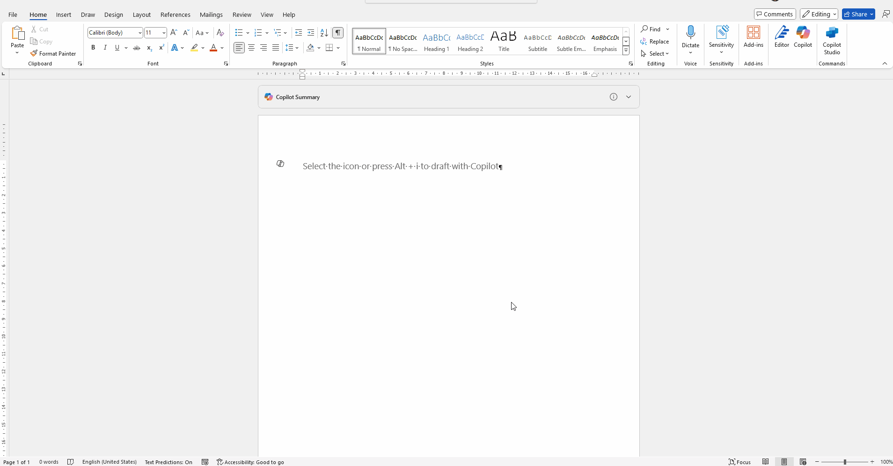
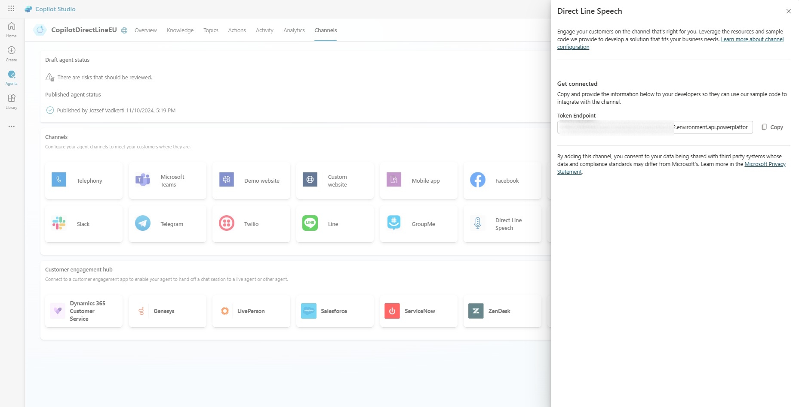

# Microsoft Copilot Studio within Microsoft Word

* [Overview](#overview)
* [Usage](#usage)
* [Contents](#contents)
* [Prerequisites](#prerequisites)
* [Clone or download the sample application](#clone-or-download-the-sample-application)
* [Configure the project](#configure-the-project)
* [Run the application](#run-the-application-and-sign-in)
* [Learn More](#learn-more)

## Overview
This sample demonstrates how to integrate a Microsoft Copilot Studio Agent into Microsoft Word as an Office Add-in. For more information, see the [Word add-ins programming overview](https://learn.microsoft.com/en-us/office/dev/add-ins/word/word-add-ins-programming-overview). This sample provides use cases for:
- content generation
- content summarization
- context menu elements inside Word documents
- main Ribbon integration




## Usage
Microsoft Copilot Studio Agents can be easily integrated into any web UI with help of BotFramework SDK. This sample illustrates this integration into Office Add-ins. The office addin has been generated by the [Yeoman generator](https://learn.microsoft.com/en-us/office/dev/add-ins/quickstarts/word-quickstart-yo?tabs=yeoman) with default values. We can implement authentication in our Office add-ins, even the Single-Sign-On (SSO) into our Copilot Agents. Please have a look at the other resources in the [BotFramework Authentication](https://github.com/jovadker/copilots/tree/main/botframeworkauth) directory.

> **Note:** Ensure that you have the necessary permissions to access the Microsoft Copilot Studio Agent and the Direct Line endpoint. If you encounter any issues, refer to the [troubleshooting guide](https://learn.microsoft.com/en-us/azure/bot-service/bot-service-troubleshoot-general?view=azure-bot-service-4.0) for assistance.


## Contents

| File/folder              | Description                                                               |
|--------------------------|---------------------------------------------------------------------------|
| `src/commands/commands.html`   | imports office.js for commands.js                         |
| `src/commands.js` | handles the context menu commands: Summarize and Rephrase. |
| `src/taskpane/config.js`           | contains configuration settings of Copilot Studio. Agent                               |
| `src/taskpane/taskpane.css`              | CSS for `taskpane.html`.                                             |
| `src/taskpane/taskpane.html`              | HTML-based UI description of taskpane.                                             |
| `src/taskpane/taskpane.js`              | contains the Direct Line endpoint of the Copilot Studio Agent.                                             |
| `manifest.xml` | defines the Word Ribbon and context menu elements for Microsoft Word add-in. |
## Prerequisites

* [Node.js](https://nodejs.org/en/download/) must be installed to run this sample.
* [Visual Studio Code](https://code.visualstudio.com/download) is recommended for running and editing this sample.
* Microsoft Word
* [Microsoft Copilot Studio Agent](https://copilotstudio.preview.microsoft.com/) must be created.


## Clone or download the sample application

To obtain the sample application, you can either clone it from GitHub or download it as a .zip file.

* To clone the sample, open a command prompt and navigate to where you wish to create the project, and enter the following command:

    ```console
    git clone https://github.com/jovadker/copilots.git
    ```

* [Download the .zip file](https://github.com/jovadker/copilots/archive/refs/heads/main.zip). Extract it to a file path where the length of the name is fewer than 260 characters.

## Configure the project

1. Open the project folder "wordaddin" in Visual Studio Code
2. create a config.dev.js file next to the "`src/taskpane/config.js`" to introduce your own Copilot Studio agent parameters:
    ```js
    const config = {
        directLineTokenUrl: 'https://XXXXXXXXXXXXX.YY.environment.api.powerplatform.com/powervirtualagents/botsbyschema/cr3d7_copilotDirectLineEu/directline/token?api-version=2022-03-01-preview',
        directLineDomain: 'https://europe.directline.botframework.com/v3/directline', // for Europe 
        secret: 'YOUR SECRET'
    };
    ```

    For US-based Copilot Studio agents please replace the directLineDomain value with the following:
    ```js
    directLineDomain: 'https://directline.botframework.com/v3/directline' // for US
    ```

    More endpoints and detailed API specification are available here: https://learn.microsoft.com/en-us/azure/bot-service/rest-api/bot-framework-rest-direct-line-3-0-api-reference?view=azure-bot-service-4.0

    <B> To obtain the DirectLine endpoint: </B>
    - Open up the Settings page of your Copilot Studio Agent
    - Go to Security and change the Authentication to No Authentication or authenticate manually
    - Open up the Channels tab and pick Direct Line Speech
        
    - Copy the URL and put into the [config.dev.js](config.dev.js) file

    <B> To get the DirectLine security secret: </B>
    - Go to your Microsoft Copilot Studio agent and open up Settings
    - Go to Security blade
    - Open up Web Channel Security to get the secret and place it into your [config.dev.js](config.dev.js) file


## Run the application

Run the Microsoft Word Addin with following steps:

1. To start the server, run the following commands from within the project directory:

    ```console
    npm install
    npm start
    ```
2. `npm start` executes a new instance of Microsoft Word 

3. Check the Copilot Studio Taskpane in Microsoft Word.

## Learn More
* [Copilot Studio Directline API](https://learn.microsoft.com/en-us/microsoft-copilot-studio/configure-web-security)
* [Bot Framework SDK](https://learn.microsoft.com/en-us/azure/bot-service/index-bf-sdk?view=azure-bot-service-4.0)
* [Office Add-ins](https://learn.microsoft.com/en-us/office/dev/add-ins/overview/office-add-ins)
* [Word Add-ins](https://learn.microsoft.com/en-us/office/dev/add-ins/word/)
